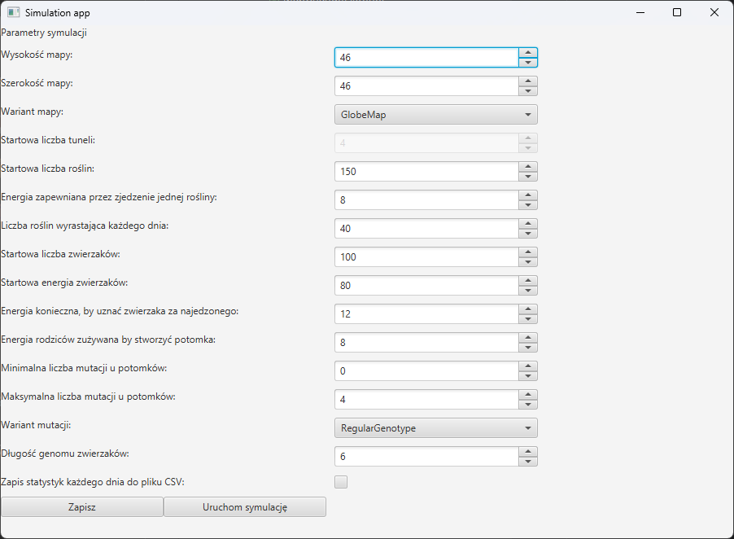
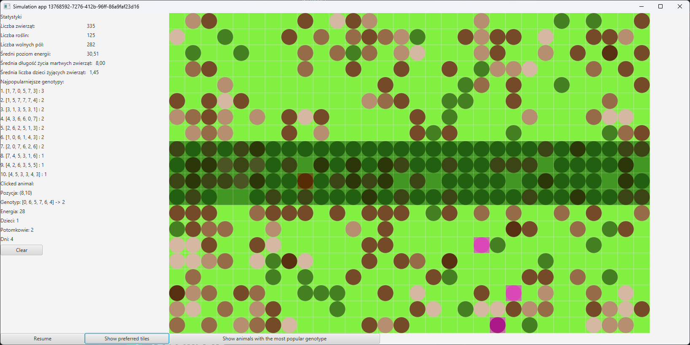

# 🦁 Symulacja Ewolucji Zwierząt 🌍

## 📖 Opis Projektu

Projekt implementuje symulację ewolucji zwierząt na mapie, gdzie jednostki poruszają się, jedzą, rozmnażają i umierają. Symulacja pozwala na konfigurację parametrów, takich jak typ mapy, liczba zwierząt, liczba roślin, energia do rozmnażania itp. Projekt wykorzystuje **JavaFX** do wizualizacji oraz zapisuje statystyki do plików **CSV**.

## 🚀 Funkcjonalności
- 🔹 **Dwa typy mapy**:
  - 🗺 **GlobeMap** – klasyczna mapa o ograniczonych krawędziach
  - 🌌 **UndergroundTunnels** – mapa z tunelami teleportującymi zwierzęta
- 🔬 **Genotypy zwierząt**:
  - 🧬 **RegularGenome** – klasyczne mutacje
  - 🔄 **SlightCorrectionGenome** – mutacje korygujące
- 🏃‍♂️ **Poruszanie się i walka o przetrwanie**:
  - 🔄 Zwierzęta losowo się przemieszczają
  - 🌱 Jedzą rośliny w celu regeneracji energii
  - ❤️ Mogą rozmnażać się po spełnieniu odpowiednich warunków
  - ⚡️ Możliwość mutacji podczas rozmnażania
  - 💀 Umierają po wyczerpaniu energii
  - 🟤 **Kolor zwierząt** odpowiada ich poziomowi energii
  - 🔴 **Zwierzę śledzone** jest oznaczone czerwonym kolorem
  - 🟣 **Zwierzęta z najpopularniejszym genotypem** są zaznaczone na fioletowo
- 🌾 **Roślinność i warunki środowiskowe**:
  - 🌿 Zielone kółka to trawa
  - 🌳 Przyciemniony obszar oznacza preferowane miejsce pojawiania się roślin
- 📊 **Statystyki symulacji**:
  - 🦓 Liczba zwierząt
  - 🌿 Liczba roślin
  - 🏞 Liczba wolnych pól
  - 🔋 Średnia energia
  - 👶 Średnia liczba dzieci
  - 🏆 Najczęściej występujące genotypy
  - 📝 Eksport danych do pliku CSV
- 🖥 **Interfejs graficzny (JavaFX)**:
  - 🏗 **Konfiguracja parametrów symulacji** (widok ustawień poniżej)
  - ⏸ Możliwość pauzowania i wznawiania symulacji
  - 📡 Podgląd statystyk w czasie rzeczywistym
  - 🎨 Interaktywna wizualizacja mapy z kolorowymi oznaczeniami

### 🛠 Konfiguracja symulacji:


### 🎮 Przykładowa symulacja:


## 📂 Struktura katalogów
```
|-- src/main/java/agh/ics/oop/
    |-- model/
        |-- animal/                # Klasy związane ze zwierzętami i ich genotypami
        |-- map/                   # Implementacja mapy i kafelków
        |-- statistics/             # Gromadzenie i zapisywanie statystyk
    |-- presenter/                  # Obsługa interfejsu użytkownika (JavaFX)
|-- src/main/resources/
    |-- config.properties           # Konfiguracja symulacji
    |-- simulation.fxml              # Widok GUI
|-- src/test/java/agh/ics/oop/model/
    |-- animal/                      # Testy jednostkowe dla zwierząt i kafelków
```

## 🛠 Instalacja i uruchomienie
1. **Wymagania**:
   - ☕ Java 17+
   - 📦 Gradle
   - 🎨 JavaFX
2. **Uruchomienie aplikacji**:
   ```sh
   ./gradlew run
   ```

## ✅ Testowanie
Projekt zawiera testy jednostkowe w katalogu `src/test/java/agh/ics/oop/model/animal/`.

Przykładowe testy:
- 🥩 `AnimalEatTest` – sprawdza, czy zwierzęta poprawnie konsumują rośliny
- 👶 `AnimalReproduceTest` – testuje rozmnażanie zwierząt
- 🗺 `RegularTileTest`, `UndergroundTileTest` – sprawdzają działanie kafelków mapy

## 🎮 Obsługa symulacji
1. **Uruchomienie aplikacji**
2. **Konfiguracja parametrów** w GUI
3. **Rozpoczęcie symulacji** – mapa zostaje wygenerowana, a zwierzęta poruszają się, jedzą i rozmnażają
4. **Podgląd statystyk** na bieżąco
5. **Pauzowanie i wznawianie** symulacji
6. **Eksport wyników** do pliku CSV

## 👨‍💻 Autorzy
Projekt został stworzony w ramach **projektu zespołowego** na potrzeby przedmiotu **Programowanie Obiektowe** prowadzonego na **AGH UST**.

